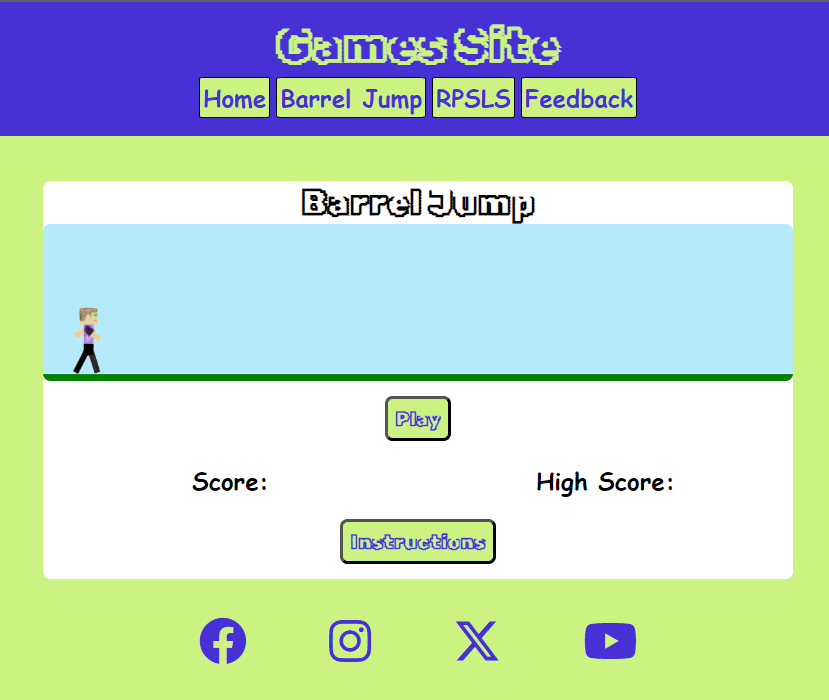

# Games Site

## Introduction

Well come to my second project for my Full Stack Diploma at Code Institute.

This website is for mini and retro style games that can be played in the browser.

A live website can be found [here](https://joelew709500.github.io/CI-project-2/index.html).

## Table of Content

* [Features](#features)
    * [Header](#header)
    * [Home](#home)
    * [Barrel Jump](#barrel-jump)
    * [RPSLS](#rpsls)
    * [Feedback](#feedback)
* [Testing](#testing)
    * [Bugs](#bugs)
    * [Lighthouse Results](#lighthouse-results)
    * [Manual Testing](#manual-testing)
* [Deployment](#deployment)
* [Final product](#final-product)
* [Credits](#credits)
    * [Content](#content)
    * [Media](#media)

## Features
[Back to table of content](#table-of-content)

### Header
* At the top of the page the header consists of the website 

### Home
* The home section introduces the user and explains what the site is about
* This section also asks the user to engage in feedback to improve and add more games to the site

### Barrel Jump
* This section contains the game called barrel jump
* This is where the user needs to avoid being hit with a barrel by jumping over it
* There is a score section that consists of the run score of the active game and then next to that is the high score to give the user something to beat
* When the user gets hit the game ends and a modal shows giving the score of the game andd  the previous high score
* The instructions are within a modal to give the users a better experience

### RPSLS
* This section consists of the Rock Paper Scissors Lizard Spock game from Big Bang Theory
* The game keeps track of the users and computers score and displays the score
* After either the user or the computer wins 5 games a modal shows and displays who won and their scores and resets the game
* The instructions are within a modal to give the users a better experience

### Feedback
* This form is to collect any feedback the users want to provide

### Footer
* This consists of the social media links that open in a new tab
* The icons also enlarge when you hover over them for a more interactive user experience 

## Testing
[Back to table of content](#table-of-content)
* I've tested the website on Edge, Chrome, Firefox
* I've tested the websites screen sizing on chrome developer tools, Google Pixel 7 and Samsung Active Tab 3
* I can confirm that the feedback form works and forces you to enter the correct information

### Bugs
* HTML
    * No errors showing on jigsaw validator
    * There is a warning for the header element for the modal but this is for design as the javascript populates this element

* CSS
    * No errors showing on jigsaw validator

* Javascript
    * Image paths were wrong on the character switch function added '.' in front of the file paths to fix
    * JShint
        * First time running JShint i had multiple warnings for missing semicolons I went back through and added these in
        * There was also a warning for the async function which is part of es8 but JShint was running es6 to fix this error i added /* jshint esversion: 8 */  to the top of the file
        * There is also a warning for functions being called within loops on lines 151 and 186 however this is as intended
        

* Accessibility
    * I can confirm that the colours and fonts used are accessible and appropriate by running lighthouse in dev tools

#### Lighthouse results

Home 

* Unfixed Bugs
    * No unfixed bugs

### Manual Testing

#### Screen size greater than 510    px
