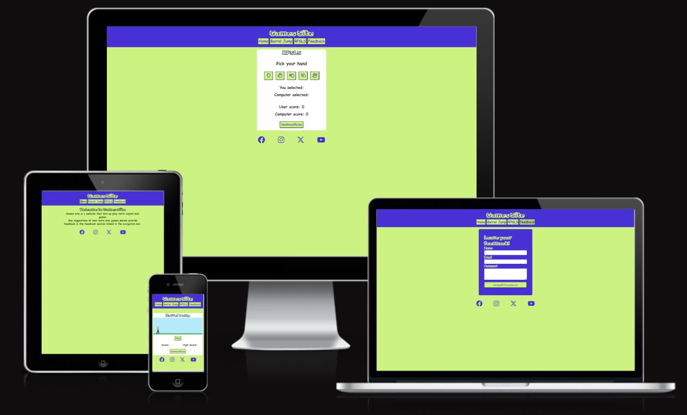

# Games Site

## Introduction

Well come to my second project for my Full Stack Diploma at Code Institute.

This website is for mini and retro style games that can be played in the browser.

A live website can be found [here](https://joelew709500.github.io/CI-project-2/index.html).

## Table of Content

* [Features](#features)
    * [Header](#header)
    * [Home](#home)
    * [Barrel Jump](#barrel-jump)
    * [RPSLS](#rpsls)
    * [Feedback](#feedback)
* [Testing](#testing)
    * [Bugs](#bugs)
    * [Lighthouse Results](#lighthouse-results)
    * [Manual Testing](#manual-testing)
* [Deployment](#deployment)
* [Final product](#final-product)
* [Credits](#credits)
    * [Content](#content)
    * [Media](#media)

## Features
[Back to table of content](#table-of-content)

### Header
* At the top of the page the header consists of the website 

### Home
* The home section introduces the user and explains what the site is about
* This section also asks the user to engage in feedback to improve and add more games to the site

### Barrel Jump
* This section contains the game called barrel jump
* This is where the user needs to avoid being hit with a barrel by jumping over it
* There is a score section that consists of the run score of the active game and then next to that is the high score to give the user something to beat
* When the user gets hit the game ends and a modal shows giving the score of the game and  the previous high score
* The instructions are within a modal to give the users a better experience

### RPSLS
* This section consists of the Rock Paper Scissors Lizard Spock game from Big Bang Theory
* The game keeps track of the users and computers score and displays the score
* After either the user or the computer wins 5 games a modal shows and displays who won and their scores and resets the game
* The instructions are within a modal to give the users a better experience

### Feedback
* This form is to collect any feedback the users want to provide

### Footer
* This consists of the social media links that open in a new tab
* The icons also enlarge when you hover over them for a more interactive user experience 

## Testing
[Back to table of content](#table-of-content)
* I've tested the website on Edge, Chrome, Firefox
* I've tested the websites screen sizing on chrome developer tools, Google Pixel 7 and Samsung Active Tab 3
* I can confirm that the feedback form works and forces you to enter the correct information

### Bugs
* HTML
    * No errors showing on jigsaw validator
    * There is a warning for the header element for the modal but this is for design as the JavaScript populates this element

* CSS
    * No errors showing on jigsaw validator

* JavaScript
    * Image paths were wrong on the character switch function added '.' in front of the file paths to fix
    * JShint
        * First time running JShint I had multiple warnings for missing semicolons I went back through and added these in
        * There was also a warning for the async function which is part of es8 but JShint was running es6 to fix this error I added /* jshint esversion: 8 */  to the top of the file
        * There is also a warning for functions being called within loops on lines 151 and 186 however this is as intended
        

* Accessibility
    * I can confirm that the colours and fonts used are accessible and appropriate by running lighthouse in dev tools

#### Lighthouse results

Home 

* Unfixed Bugs
    * No unfixed bugs

### Manual Testing

#### Screen size greater than 510    px

#### Header

Feature | Desired Outcome | Pass / Fail
--- | --- | ---
Website logo/title | Takes you to index.html | Pass
Home button | Shows home section on hover enlarges | Pass
Barrel Jump button | Shows barrel jump section on hover enlarges | Pass
RPSLS button | Shows rpsls section on hover enlarges | Pass
Feedback button | Shows feedback section on hover enlarges | Pass

#### Home
Feature | Desired Outcome | Pass / Fail
--- | --- | ---
Section | On load zooms in | Pass

#### Barrel Jump
Feature | Desired Outcome | Pass / Fail
--- | --- | ---
Section | On load zooms in | Pass
Play Button | Starts game | Pass
Game Barrels | Generate Barrels | Pass
Character Jumps | Jumps when click on game window | Pass
Character Runs | Character alternates between two images | Pass
Scores | Show running scores and high score | Pass
Game Over | Only activates on barrel hit character | Pass
Game over results | Results show in modal | Pass
Instructions | Shows Modal with instructions | Pass

#### RPSLS
Feature | Desired Outcome | Pass / Fail
--- | --- | ---
Section | On load zooms in | Pass
Hand Selection | Each hand selects correctly | Pass
Display selection | Display correct user and computer selection of hands | Pass
Result | Show result of round | Pass
Scores | Show scores of user and computer | Pass
Game over results | Results show in modal after 5 wins by one party | Pass
Instructions | Shows Modal with instructions | Pass

#### Feedback page
Feature | Desired Outcome | Pass / Fail
--- | --- | ---
First Name input | Mandatory | Pass
Last Name input | Mandatory | Pass
Comments| Mandatory| Pass
Submit Feedback | Only submits when all fields are populated and takes to https://formdump.codeinstitute.net/ with Congratulations! message | Pass

#### Footer
Feature | Desired Outcome | Pass / Fail
--- | --- | ---
Social media icons | On hover increase in size | Pass

### Screen size equal to or less than 510px
#### Barrel Jump

Feature | Desired Outcome | Pass / Fail
--- | --- | ---
Game width | on 510px screen width or smaller game adjusts | Pass
Barrel Generation | Barrels generate at the edge of game | Pass

## Deployment
[Back to table of content](#table-of-content)

I used GitHub pages to deploy my final project. To do this I had to:

1. Create a repository on GitHub.
2. Clone the repository on your chosen source code editor (VS code in my case) using the clone link.
3. Add files to Git.
4. Use git within VS code to push the code.
5. Go to GitHub
6. Select your repository.
7. Select settings.
8. Select pages on the left menu.
9. Click on the main branch.
10. This will generate a link with your website live.

## Final product

[Back to table of content](#table-of-content)

Please see screenshots of each page below

Home

Barrel Jump

RPSLS

Feedback

## Credits
[Back to table of content](#table-of-content)
### Content
* The instructions for RPSLS were taken from the Big Bang Theory
* The code for the modal is a modified version of the mozilla.org code found [here](https://developer.mozilla.org/en-US/docs/Web/HTML/Element/dialog)

### Media
* Favicon.cc was used to create the site favicon
* GIMP 2.10 (gimp.org) was used to create the character and barrel images
